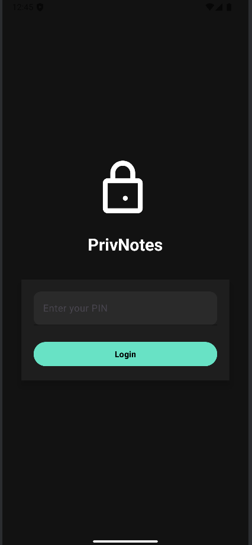
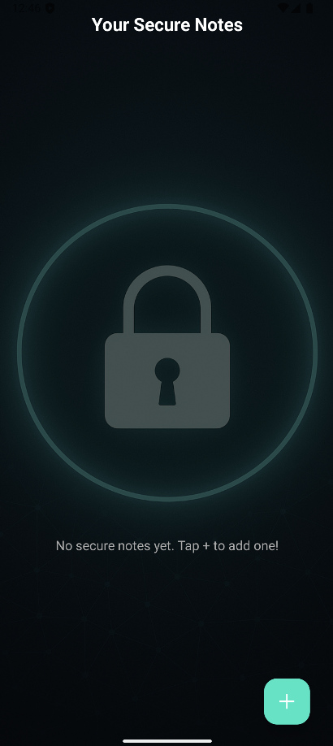
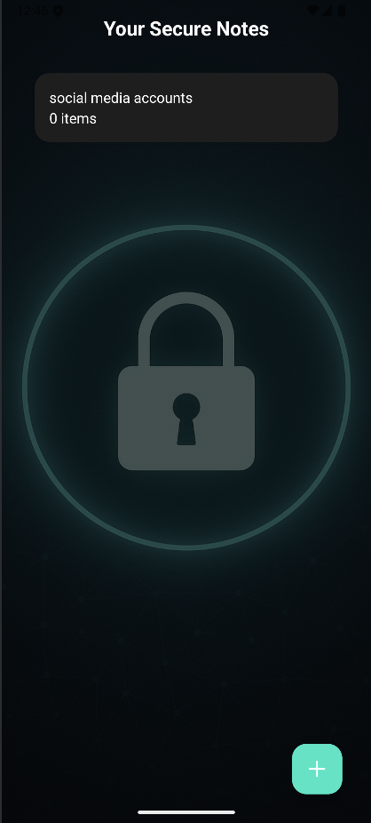
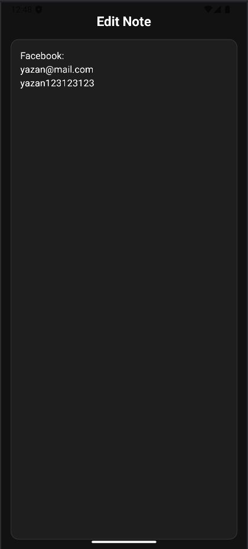
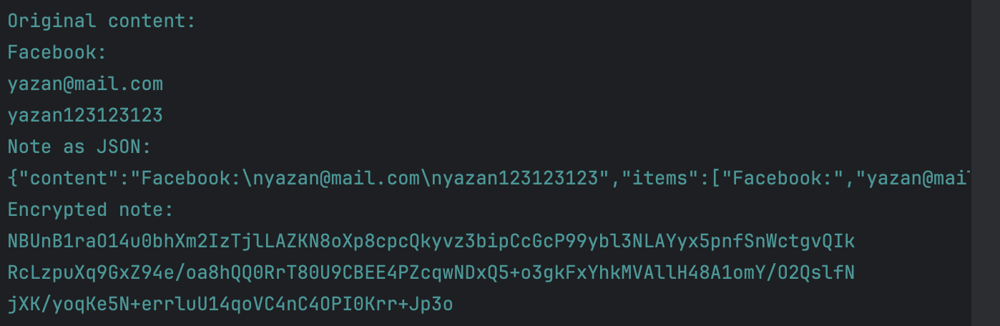

# 🔐 PrivNotes

> A lightweight and secure note-taking Android app that encrypts your notes using AES-128 and stores them safely on your device.

---

## 📱 Features

- 🧠 Simple and intuitive interface
- 🔐 AES-128 encryption using key derivation
- 🔑 User-defined PIN used as encryption key (never stored)
- 📂 Secure local storage via SharedPreferences
- ➕ Add, edit, and delete notes easily
- 🎨 Material Design for a smooth user experience

---

## 🔧 How It Works

### 🔐 Encryption
- **Algorithm**: AES
- **IV (Initialization Vector)**: Randomly generated for each encryption, stored with the ciphertext

### 📦 Storage
- Notes are encrypted and stored locally in `SharedPreferences` under the key `"encrypted_notes"`
- Data is Base64 encoded and includes the IV for proper decryption

---

### 🛡 Security Highlights
  - Notes are unreadable without the correct PIN
  - All data is stored locally — nothing leaves the device

---

### 🔐 Login Screen

### 📝 Empty Notes List

### 📝 Notes List

### ✏️ Edit Note

### 🔐️ Encrypted Notes

